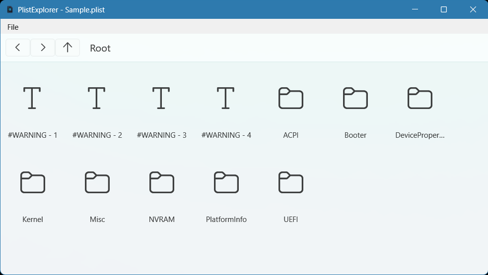

#  PlistExplorer

A lightweight Windows desktop application for viewing and editing Apple `.plist` (Property List) files, built with WPF and .NET.



Apple's XML property list format is commonly used for configuration and data storage on macOS and iOS. PlistExplorer brings a native Windows experience for inspecting and modifying these files without needing a Mac.

## Features

- **Open and browse `.plist` files** in a familiar tree view, with support for nested arrays and dictionaries
- **Edit values** for all standard plist element types: String, Number, Boolean, Date, Data, UID, Array, and Dictionary
- **Save changes** back to the original XML plist format
- **Recent files list** for quickly reopening previously viewed files
- **MVVM architecture** powered by the [CommunityToolkit.Mvvm](https://github.com/CommunityToolkit/dotnet) library

## Getting Started

### Prerequisites

- Windows 10/11
- [.NET 10 SDK](https://dotnet.microsoft.com/download) or later
- Visual Studio 2022 (or later) with the .NET desktop development workload, for building from source

### Building from source

```powershell
git clone https://github.com/atshaw1994/PlistExplorer.git
cd PlistExplorer
dotnet build
```

### Running

```powershell
dotnet run --project PlistExplorer.csproj
```

Or open `PlistExplorer.slnx` in Visual Studio and press F5.

## Usage

1. Launch PlistExplorer.
2. Use **File > Open** (or the toolbar) to select a `.plist` or `.xml` file.
3. Browse and expand the element tree to inspect values.
4. Double-click an element to edit its name, type, or value.
5. Save your changes with **File > Save**.

## Project Structure

- `Models/` – Core data types representing plist elements
- `Viewmodels/` – MVVM view models that drive the UI
- `Views/` – WPF windows and user controls
- `Services/` – Supporting services such as recent files persistence
- `Helpers/` – Value converters used in XAML bindings

## Contributing

Issues and pull requests are welcome. Please open an issue to discuss significant changes before submitting a PR.

## License

This project is licensed under the terms specified in [LICENSE.txt](LICENSE.txt).